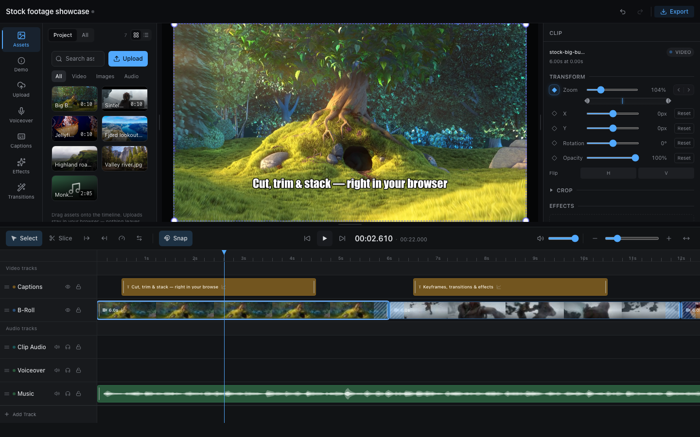

# @hygc/editor
[](https://github.com/m333x/hygc-editor/actions/workflows/ci.yml)
[](./LICENSE)

<p align="center">

</p>

A browser NLE video editor as an embeddable React package — Remotion-powered
preview, client-side WebCodecs export, and a single host interface that wires
it to any backend.

**[▶ Try the live demo](https://m333x.github.io/hygc-editor/)** — runs
entirely in your browser: no signup, no backend, nothing uploaded anywhere.



## Features

- **Multi-track timeline** — video, image, audio, and caption tracks; drag,
  trim, slice, snap; linked clip audio; lock/mute/reorder; Premiere-style
  track-select tools.
- **Keyframes** — per-property animation tracks (position, scale, rotation,
  opacity, caption size/offset) with easing, edited from the inspector.
- **Transitions** — fade, slide, pan, blur, zoom, wipe, spin, and more, with
  paired crossfades and adjustable motion blur.
- **Captions** — global and per-clip styling with in/out animations; AI
  transcription plugs in through the host.
- **Audio** — waveforms, fade envelopes, auto-ducking, in-editor voiceover
  recording.
- **Effects** — non-destructive, reorderable per-clip effect stacks.
- **Export** — fully client-side render via WebCodecs (H.264/H.265/AV1), or
  a host-provided server render farm with credits and history.

## The demo is a reference host

The editor is host-agnostic: persistence, asset storage, and optional
capabilities are supplied through one `EditorHost` adapter
([`src/host/types.ts`](./src/host/types.ts)). The [`demo/`](./demo) app is a
complete reference implementation in a few hundred lines — projects in
localStorage, uploads in IndexedDB, bundled stock footage, and no server at
all.

```bash
npm ci
npm run demo:dev
```

## Embedding

Wrap `EditorPage` in an `EditorHostProvider` and supply your `EditorHost`
adapter:

```tsx
import { EditorHostProvider, EditorPage } from '@hygc/editor'

<EditorHostProvider host={myHost}>
  <EditorPage />   {/* expects a :projectId route param */}
</EditorHostProvider>
```

Required host surface: `projects` (get/saveState/rename), `resolveAssetUrls`,
`useAssetLibrary` (a React hook), and an `AssetBrowser` component. Optional
capabilities degrade gracefully when omitted: `serverExport` (render farm +
credits + history), `transcribeAudio` (AI captions), `projects.seed`,
`assetPanelExtraTabs`, `exit`. Implement the interface once against your own
storage/asset backend and the editor is fully wired.

Consumers provide the Tailwind v4 theme: scan this package's source
(`@source "…/hygc-editor/src"`) and define the semantic tokens
(`--background`, `--primary`, `--clip-video-bg`, …). The demo's
[`theme.css`](./demo/src/theme.css) documents the full token set and is a
ready-made dark theme you can copy.

## Install

Until it lands on the npm registry, install straight from GitHub:

```bash
npm install github:m333x/hygc-editor
```

This builds the package on install (`tsc` → `dist/`, ESM + `.d.ts`). Provide
the peer dependencies listed in `package.json` (React 19, Remotion 4.0.475,
etc.) and use a bundler (Vite/Next/webpack) for extensionless module
resolution.

## Development

```bash
npm ci             # install + build
npm run typecheck  # package types
npm test           # vitest — engine, stores, timeline math
npm run demo:dev   # run the demo host against the live source
```

## Provenance

Extracted from [HyGC](https://github.com/m333x)'s production monorepo, where a
Supabase-backed host drives the same package. Public history starts at the
extraction commit.

## Stock media credits (demo)

- *Big Buck Bunny*, *Sintel* — © Blender Foundation,
  [Blender open movies](https://studio.blender.org/films/) (CC-BY)
- *Jellyfish* — [test-videos.co.uk](https://test-videos.co.uk) sample clip
- *Monkeys Spinning Monkeys* — Kevin MacLeod,
  [incompetech.com](https://incompetech.com) (CC-BY 4.0)
- Photos — [picsum.photos](https://picsum.photos)

## License

Dual-licensed: **AGPL-3.0-only** for open-source use, **commercial** for
proprietary use. See [`LICENSE`](./LICENSE) and
[`COMMERCIAL-LICENSE.md`](./COMMERCIAL-LICENSE.md).
